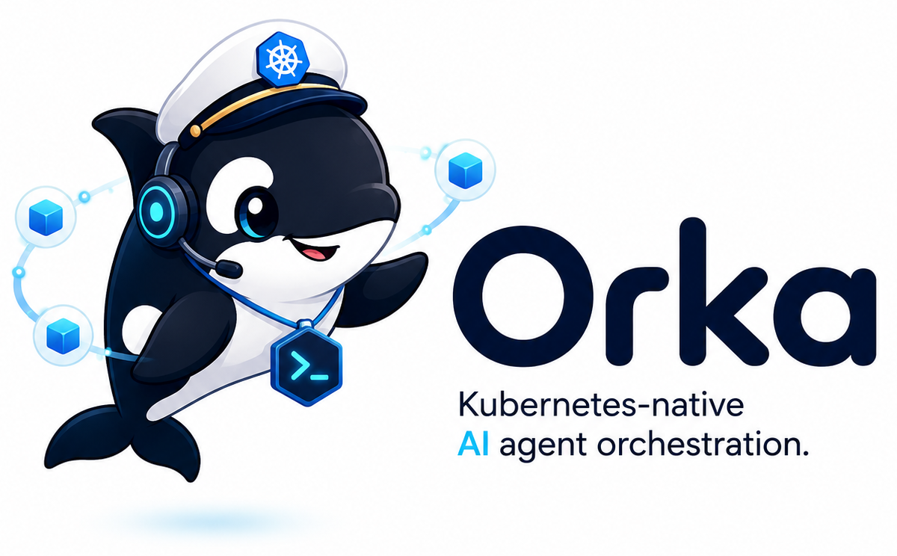

<div align="center">



# Orka Gateway A2A

**Call Orka Agents through A2A.**

[Getting Started](docs/getting-started.md) · [Protocol](docs/protocol.md) · [Compatibility](docs/compatibility.md) · [Documentation](#documentation)

</div>

---

Orka Gateway A2A connects an [A2A](https://a2a-protocol.org/) client to an
[Orka](https://github.com/orka-agents/orka) Agent through Orka's generic gateway.
Send a text message, let Orka run the Task, then read the result with `GetTask`.
The adapter runs separately from the controller and uses Orka's durable gateway
ledger — no second task queue, database, or execution engine.

```text
official A2A client → TLS adapter → Orka gateway event → real Orka Task
                     ↑ GetTask ← durable gateway delivery ← result
```

> [!IMPORTANT]
> **Orka Gateway A2A is experimental and under active development.** APIs and behavior may change without notice between releases, and it is not yet recommended for production use. It implements a text-only A2A subset, not full protocol conformance. Feedback, bug reports, and feature ideas are welcome — please [open an issue](https://github.com/orka-agents/orka-gateway-a2a/issues).

> [!NOTE]
> The organization and repositories are intended to be donated to a community-governed foundation at the appropriate time. Until then, the project is governed by Microsoft policy, and external contributors are required to sign the Microsoft Contributor License Agreement (CLA).

## Features

- **Official A2A SDK** — Agent Card discovery, JSON-RPC, text messages, and a small Go client using `a2a-go/v2` v2.5.0.
- **Orka-owned execution** — Tasks, retries, Sessions, retention, and cleanup stay in Orka.
- **Retry-safe requests** — Stable message IDs deduplicate admission; Task IDs fence the original admission across restarts and retention expiry.
- **Pull results** — `GetTask` reads owned, correlated final/error deliveries from the durable ledger.
- **Explicit trust boundary** — TLS and four separate file-backed credentials; one configured caller domain per deployment, not per-user or multi-tenant authorization.

## Quick start

### Build and test

Use Go 1.25 or newer. From the repository root:

```bash
make test
make build
```

This builds `bin/orka-gateway-a2a` and `bin/a2a-client`. Tests use an HTTP fixture
at the Orka boundary; no cluster, credentials, or model service is needed.

### Connect to Orka

You need a working Agent, the gateway resources, and access to Orka's operator
API. The runtime-backed path uses Orka's existing gateway implementation; native
`type: ai` Agents still need the open upstream changes listed in
[Compatibility](docs/compatibility.md).

Follow [Getting started](docs/getting-started.md) to review
[`config.example.json`](config.example.json), provision the four credential files
and TLS certificate/key, and set up the route. The example manifests are wiring,
not a complete cluster installation. With those files available at the paths in
your non-secret config:

```bash
./bin/orka-gateway-a2a -config /path/to/non-secret-config.json
```

For a container, [build locally and mount the files at runtime](docs/getting-started.md#run-in-a-container).
There is no published adapter image or release install command here.

### Send a message

Use your adapter's HTTPS origin and the **external caller** token file, not a
Gateway or operator token. For a private CA, add `-ca-file /path/to/ca.crt`.

```bash
./bin/a2a-client -url https://agent.example.com \
  -token-file /path/to/client-token -message-id example-question-1 \
  -text 'What is 17 times 23?'
```

The client waits for a result by default and prints the returned Task as JSON.
For nonblocking calls, polling, and same-Session messages, see
[Using the client](docs/getting-started.md#use-the-client).
**Retry with the identical message ID and payload.** A timeout does not cancel
work. Everyone sharing the caller token can read every Task in its configured domain.

## Documentation

| | |
| --- | --- |
| [Getting started](docs/getting-started.md) | Credentials, RBAC, TLS, container mounts, and client commands |
| [Protocol](docs/protocol.md) | Supported calls, identity, ownership, results, callbacks, and retention |
| [Compatibility](docs/compatibility.md) | SDK and Orka versions, native-AI prerequisites, and verification limits |
| [Orka Gateway API](https://github.com/orka-agents/orka/blob/main/website/docs/reference/gateway-api.md) | Upstream ingress, delivery, and operator APIs |
| [Operating Orka gateways](https://github.com/orka-agents/orka/blob/main/website/docs/operations/gateways.md) | Upstream durability, TLS, recovery, and cleanup |

## Contributing

See [CONTRIBUTING.md](CONTRIBUTING.md) for the CLA, commit sign-off, and build/test
commands. Please follow the [Code of Conduct](CODE_OF_CONDUCT.md) and report
vulnerabilities through [SECURITY.md](SECURITY.md), not public issues.

## License

[MIT](LICENSE), copyright Microsoft Corporation.
